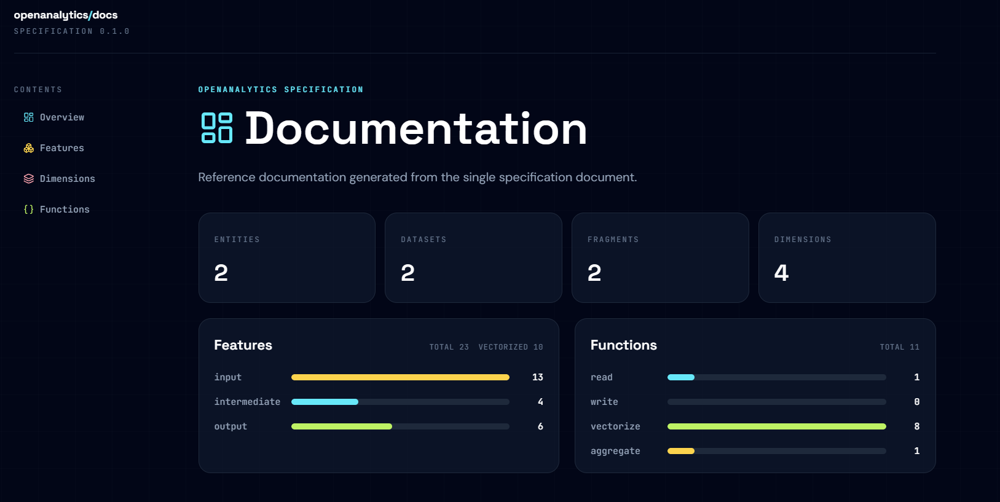
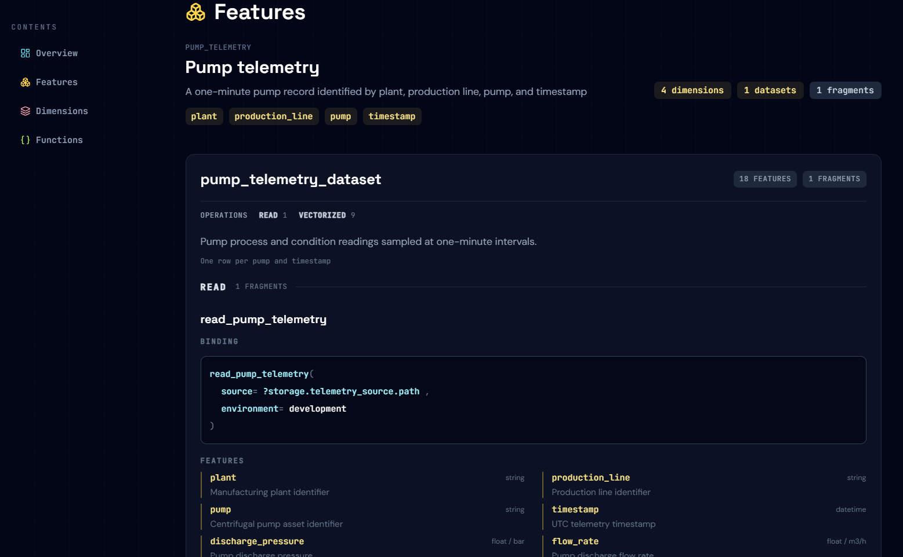

# Automatic documentation

The framework knows each source input, calculation, resulting feature, dependency, and source-code location.

This enables automated documentation out of the box.
No more manually maintained internal wiki pages.

Additionally, documentation is easy to understand.
The analytical building blocks are standardized and everybody speaks with the same terminology.

