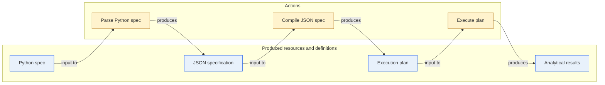

# Project architecture

Uptimely Core separates authoring, specification, planning, and execution into
distinct layers. Each layer has a different responsibility and a different
level of portability.

## Layer Hierarchy



```text
Python spec -> Parse Python spec -> JSON specification -> Compile JSON spec -> Execution plan -> Execute plan -> Execution result
```

The Python spec is optional. It is a developer-friendly definition that may be
written in Python and then converted into the authoritative JSON specification.

**The JSON specification is the definitive contract**. The compiler turns that
contract into a portable execution plan. The plan defines what runs, in what
order, and under which declared execution context. The engine reads the plan and
executes it against live runtime state.

## Python Spec

The Python specification is a definition layer for authoring analytics.

It lets developers describe a specification with Python objects, imports,
helpers, reuse, and editor support. This is useful when a project wants a
maintainable source format for larger specifications or generated fragments.

The Python spec is not the authoritative runtime document. Its purpose is to
produce the same specification structure that could also be written directly as
JSON.

Use the Python spec when developers want autocomplete and type checking,
repeated specification patterns, or a higher-level authoring format that exports
to JSON.

For enterprise setup the original meta data might be scattered even in several systems which Python reads and generates the JSON specification in standard format.

## Python parser

This step reads the Python specification and materializes the equivalent JSON
spec structure so that the result can be validated, documented, and compiled.

## JSON Spec

The JSON specification document is the source of truth for the definitions.

It is the portable contract for an analytics workflow. It describes entities,
datasets, dimensions, function catalogs, fragments, features,
results, bindings, and engine hints in a format that does not depend on Python authoring
code.

In fact, the specification uses primitive function and argument data type definitions, so it is agnostic of tools and programming languages.

Other tools should treat the JSON spec as the source of truth. Documentation,
validation, graph generation, compilation, and execution should all be possible
from this document.

The JSON specification is adviced to keep under version control system such as git.

## Compiler

The compiler is an action that turns the definitive JSON specification into a
portable execution plan.

It decides what runs, in what order, and under which declared execution
context. It builds the callable graph, resolves dependencies, creates execution
stages, records callable metadata, and can export the plan as a document.

The compiled plan should be portable. It should describe the intended execution
without depending on one specific in-memory engine implementation.

The compiler resolves structural references such as `$datasets.@`,
`$features.<id>`, `$dimensions.<id>`, and `$fragments.<id>` into identifiers.
It does not resolve runtime values such as loaded dataframes or physical storage
locations; those are left as `?<namespace>.<object>.<attribute>` placeholders for
the engine to resolve. The engine binds physical implementation variables at
runtime according to the function template's primitive argument types.

Version 0.1 declares `polars` as the only supported dataframe backend. The
compiled plan records that executable claim as `required_backend`, and the
engine validates compatibility at runtime. Orchestration is outside the
specification and plan contracts.

Separated definition, planning and execution enables versatile use cases. In
cloud environments with unlimited resources, it may be possible to execute the
whole global plan on one engine. Another lightweight engine can execute a subset
of features in restricted environments.

## Plan

The plan is a definition produced by the compiler.

It is a portable description of the workflow that specifies what should run, in
what order, and under which declared execution context. The plan is not a live
runtime object; it is the formalized outcome of compilation.

A stage is a dependency layer within that plan. It groups operations that can run
in the same wave because they do not depend on one another. The compiler builds a
callable dependency graph where nodes are operations and edges represent upstream
feature or dataset dependencies. It then asks the graph for its parallel
bottom-up topological order, which yields layered execution groups. Each layer is
serialized as a stage in the plan, and the engine later resolves those stage IDs
back into executable operations.

This gives the plan both a deterministic execution order and a clear boundary for
parallel execution inside a single stage. In practice, stage 1 contains the
independent source and preparation work, stage 2 contains calculations whose
inputs are now available, and later stages continue until the downstream writes
and final outputs are reached.

## Engine

The engine reads the plan and executes it.

It loops through the plan stages, runs each operation, stores produced
runtime data, and makes results available to dependent operations. It resolves
compiled dataset and feature identifiers into runtime objects such as
dataframes and calculated feature expressions.

The Python engine resolves `?<namespace>.<object>.<attribute>` runtime
placeholders (such as `?storage.telemetry_source.path`) against `runtime_resources`
supplied when the engine is constructed. This is how a compiled plan runs against
different physical storage locations in different environments without
recompiling the specification.

The engine in this repository executes plans with Python functions and the
Polars backend. Its runtime state is returned as an execution result containing
datasets, calculated outputs, operation statuses, durations, failures, and the
plan version.

## Responsibility Boundary

The main boundary is between definitions and actions.

Definitions describe the intended state of the system:

- Python spec (definition)
- JSON spec (definition)
- Plan (definition)

Actions transform or execute those definitions:

- Python parses (action)
- Compiler (action)
- Engine (action, reads plan and executes)

```text
Python spec (definition) -> Python parses (action) -> JSON spec (definition)
JSON spec (definition) -> Compiler (action) -> Plan (definition)
Plan (definition) -> Engine (action, reads plan and executes)
```

This separation keeps the JSON specification stable, the compiler deterministic,
and engine implementations replaceable.
